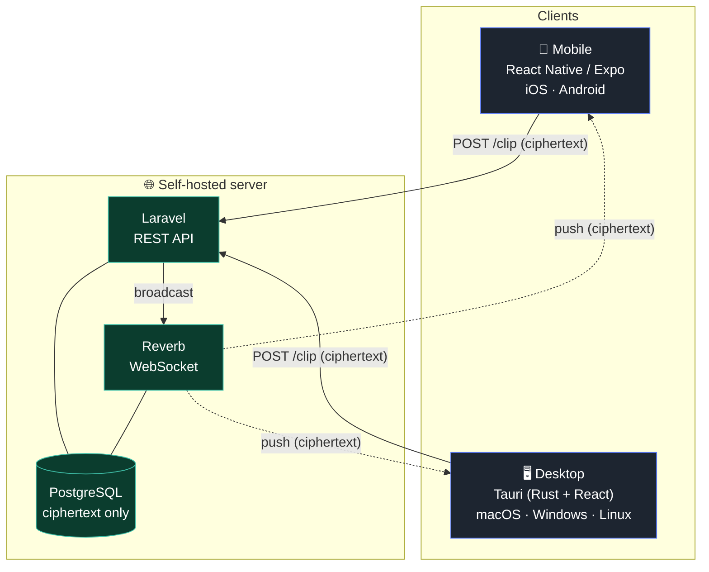
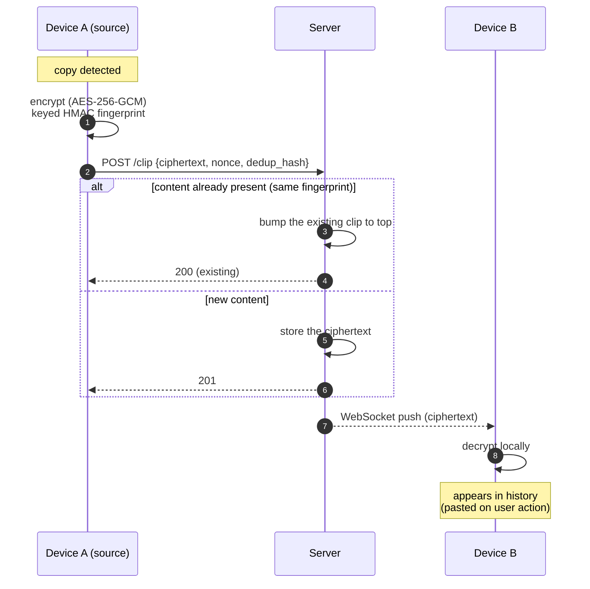
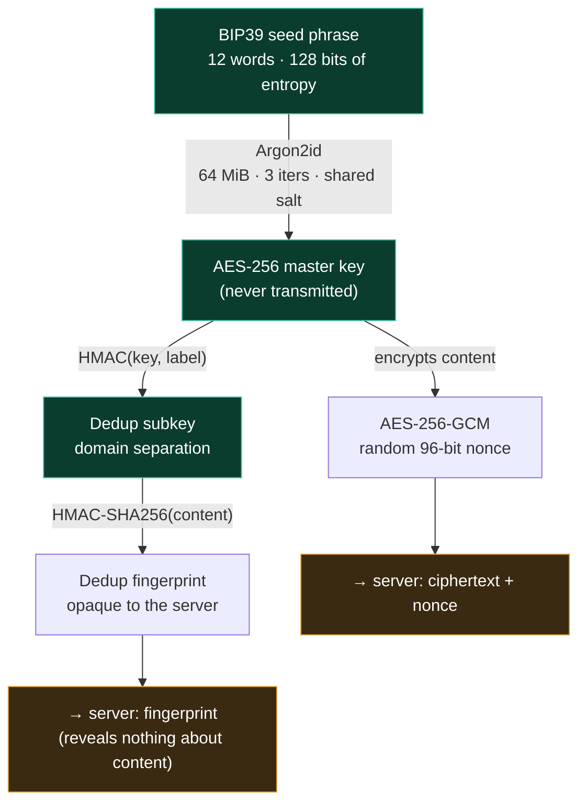

<div align="center">


# Mimoe

**Self-hosted, end-to-end encrypted shared clipboard.**

Copy on one device, paste on another. The server only ever sees ciphertext.

Phone (iOS / Android) ↔ computer (macOS / Windows / Linux), even outside your local network.

[](https://github.com/kevindupas/mimoe/actions/workflows/tests.yml)
[](server/LICENSE)
[](desktop/LICENSE)


### Download

<a href="https://github.com/kevindupas/mimoe/releases/latest/download/Mimoe_0.1.0_universal.dmg"></a>
<a href="https://github.com/kevindupas/mimoe/releases/latest/download/Mimoe_0.1.0_x64-setup.exe"></a>
<a href="https://github.com/kevindupas/mimoe/releases/latest/download/mimoe-v0.1.0.apk"></a>

<sub>or browse all files on the <a href="https://github.com/kevindupas/mimoe/releases/latest">latest release</a></sub>

</div>

---

## Why Mimoe

Every existing option forces a compromise. Apple's Universal Clipboard stops at the Apple ecosystem. KDE Connect needs the same local network. Cloud alternatives read your clipboard in the clear on their servers.

Mimoe ticks all four boxes at once:

- **Truly cross-platform** — Android ↔ macOS ↔ Windows ↔ iOS ↔ Linux, not just within one ecosystem.
- **End-to-end encrypted** — content is encrypted on the source device. The server relays opaque bytes; it can't read anything.
- **Self-hosted** — your server, your data. Multi-user, each account has an isolated history.
- **Crosses the internet** — mobile network, CGNAT, on a train: it works, with no network setup. Clients always initiate the connection outbound.

---

## Design principles

1. **E2E first.** Content is encrypted client-side (AES-256-GCM). The key never leaves the device (Keychain / Keystore / Credential Manager). The server stores and broadcasts ciphertext.
2. **No guessable secret on the server.** Even deduplication uses a *keyed* fingerprint (HMAC): the server can tell that two clips are identical, never what they contain.
3. **No destructive paste.** A received clip lands in the history; the user chooses to copy it out. Nothing overwrites the clipboard without an action.
4. **Sensitive content stays local.** A copy marked "sensitive" (password manager) is never encrypted or sent.
5. **Ephemeral by default.** 24h TTL or the last 100 clips, auto-purged. Pinned clips survive.

---

## Architecture

Clients **always** initiate the connection (outbound POST + WebSocket). No inbound port to open on the client side → traverses NAT / CGNAT / mobile networks with zero configuration.



Server exposure: behind a TLS reverse proxy (Caddy / nginx / Traefik) or a private network (Tailscale). Content is encrypted regardless, but the device token requires HTTPS.

---

## Clip lifecycle

From a copy on one device to the decrypted display on the others. The server only handles opaque data.



---

## Cryptographic model

Every device derives **the same key** from the same seed phrase, thanks to a shared salt. The server has neither the seed, nor the key, nor the plaintext. Rust ↔ JS interoperability is verified by locked test vectors.



**What the server sees:** ciphertext, nonce, an opaque HMAC fingerprint, metadata (timestamp, type, origin device).
**What it never sees:** the seed, the key, the plaintext, or the content behind a fingerprint.

### Pairing a new device

On account creation, the device generates a 12-word seed (BIP39, with checksum) and has the user write it down. Each additional device re-enters those 12 words — that's the only thing that derives the key, and it never travels over the network.

---

## Components

| Folder | Stack | Role | License |
| --- | --- | --- | --- |
| [`server/`](server/) | Laravel · Reverb · PostgreSQL | REST API, real-time broadcast, TTL purge, accounts, FCM push | AGPL-3.0 |
| [`desktop/`](desktop/) | Tauri · Rust · React · Tailwind | Menu-bar app: capture, history, clipboard writes | GPL-3.0 |
| [`mobile/`](mobile/) | React Native · Expo | iOS + Android: share-sheet send, live history, notifications | GPL-3.0 |

Each folder has its own detailed README.

---

## Platforms

| | Send | Receive | Status |
| --- | --- | --- | --- |
| **macOS** | automatic clipboard capture | history + paste | ✅ |
| **Windows** | automatic clipboard capture | history + paste | ✅ |
| **Linux** | — | — | 🚧 compiles, not finished |
| **Android** | share sheet | history + notifications | ✅ |
| **iOS** | share sheet | history | 🚧 never built (Apple account needed) |

---

## Quick start

### Server (Docker)

```bash
cd server
cp .env.docker.example .env      # fill in DB_PASSWORD, REVERB_*, APP_KEY
docker compose up -d --build
```

Put the server behind a TLS reverse proxy. Close registrations on a personal instance with `MIMOE_REGISTRATION_ENABLED=false`.

### Desktop

```bash
cd desktop
npm install
npm run tauri dev        # dev
npm run tauri build      # signed bundle
```

### Mobile

```bash
cd mobile
npm install
npx expo run:android     # dev build (not Expo Go — native modules)
```

Details, environment variables and prerequisites: see each folder's README.

---

## Security

The E2E model, key management and API have been audited (crypto, access control, injection, supply chain). The server-side foundation is zero-knowledge.

To report a vulnerability: see [SECURITY.md](SECURITY.md). Do not open a public issue for a security problem.

---

## Privacy & data

These are the technical properties of the design, not a legal compliance claim. A hosted offering would come with its own privacy policy and processing agreement.

- **The server cannot read your content.** Clips and files are encrypted client-side; the encryption key is derived from your seed phrase and never leaves your devices. The server stores ciphertext and an opaque fingerprint — nothing it can decrypt.
- **Minimal personal data.** The server holds what an account needs: an email, per-device metadata, and timestamps. It never holds clipboard content in the clear.
- **Short retention by default.** Clips expire after 24h (configurable); only pinned ones survive. Less stored data, less exposure.
- **EU-hostable.** Self-host anywhere, including an EU provider (e.g. OVH) to keep data in Europe and avoid non-EU transfers.
- **Push is optional and content-free.** Notifications carry no clipboard content — only a wake-up signal. Android push currently routes through Firebase Cloud Messaging (a Google service); an EU-friendly alternative (UnifiedPush / self-hosted) is planned. iOS push, when built, uses Apple's APNs (unavoidable on iOS).

---

## License & model

Mimoe is **open source**, on a model close to Bitwarden's: the code is open, you can self-host everything for free.

- **Server — [AGPL-3.0](server/LICENSE)**: anyone hosting a modified version must publish their changes. Prevents a third party from closing the service by offering it as SaaS.
- **Clients (desktop, mobile) — [GPL-3.0](desktop/LICENSE)**: a fork must stay open under the same license.

For a product whose promise is "I can't read your clipboard", open clients are essential: they're the only way for a user to verify the key never leaks.

Contributions welcome — see [CONTRIBUTING.md](CONTRIBUTING.md).
