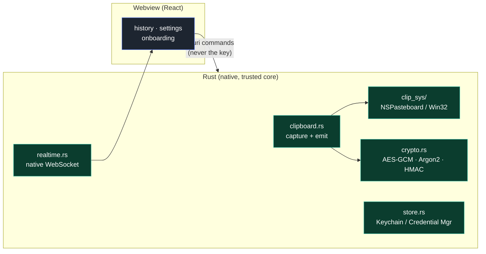

<p align="center"></p>

# Mimoe — Desktop


[](LICENSE)

Menu-bar app for [Mimoe](../README.md) on macOS / Windows / Linux. Captures the clipboard, shows the decrypted history, writes the clipboard on demand.

Stack: Tauri 2 · Rust (native backend) · React 19 + TypeScript + Tailwind 4 (webview) · Vite.

## What it does

- **Automatic capture** of the clipboard (text, images, files) → encrypt → send.
- **Live history** over WebSocket, decrypted locally, with search, filters, favorites, masking.
- **Writes** a clip to the system clipboard on user action.
- **"Sensitive" copies**: the seed and password-manager copies are never sent.
- Seed-phrase onboarding (generate + verify, or type on an additional device).

## Internal architecture

The sensitive logic (crypto, clipboard, WebSocket, secrets) lives in **Rust**; the webview never receives the key.



The native clipboard is abstracted per platform in [`src-tauri/src/clip_sys/`](src-tauri/src/clip_sys/): `macos.rs` (NSPasteboard) and `windows.rs` (Win32 via `clipboard-win`). The orchestration (loop, dedup, encryption, send) is shared. Adding Linux = adding a `linux.rs`.

The WebSocket runs in a **native Rust thread** (tungstenite), not in the webview: WKWebView freezes when the window is hidden.

## Dev

```bash
npm install
npm run tauri dev
```

Prerequisites: Rust (MSVC toolchain on Windows), the [Tauri system dependencies](https://tauri.app/start/prerequisites/), WebView2 (bundled on Windows 11).

## Build

```bash
npm run tauri build
```

## License

[GPL-3.0](LICENSE).
